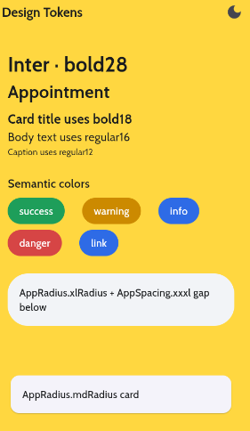
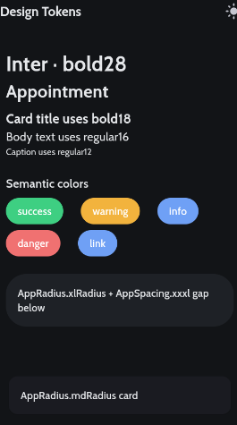

# tokenkit

**Design tokens as Flutter theme extensions** — semantic colors, typography, spacing and radius from one source of truth, with zero magic numbers.

[](LICENSE)
[](https://flutter.dev)
[](https://pub.dev/packages/flutter_lints)

`tokenkit` wires your design tokens into `ThemeData` as `ThemeExtension`s and puts them one keystroke away on `BuildContext`. Widgets consume *meaning* (`context.colors.success`, `context.typography.bold18`) instead of raw values — so the whole app feels built by one hand, and rebranding is a one-line change.

<table>
  <tr>
    <td align="center"><b>Light</b></td>
    <td align="center"><b>Dark</b></td>
  </tr>
  <tr>
    <td></td>
    <td></td>
  </tr>
</table>

<sub>Screens from the <a href="example/"><code>example/</code></a> app — a custom brand palette, the Inter/Tajawal font via <code>google_fonts</code>, and every token.</sub>

## Contents

- [Features](#features)
- [Install](#install)
- [Quick start](#quick-start)
- [Token reference](#token-reference)
- [Full example](#full-example)
- [Customizing](#customizing)
- [How to extend](#how-to-extend)
- [Contributing](#contributing)
- [License](#license)

## Features

- **Semantic colors, not raw colors** — `context.colors.success` instead of `Colors.green`; rebrand in one place.
- **Typography as a `ThemeExtension`** — weight+size named styles (`bold14`, `regular16`, `bold18`, …) so the name says exactly what it renders.
- **Smooth theme switching** — both extensions implement `lerp()`, so light ⇄ dark animates instead of jumping.
- **One spacing scale** — `AppSpacing.xs … xxxl`, no more `SizedBox(height: 13)`.
- **Shared radius** — `AppRadius.mdRadius`, `pillRadius`, one design language across card/dialog/button.
- **Padding helpers** — `widget.withScreenPadding()`, `.withHorizontalPadding()`, `.withVerticalPadding()`.
- **Seed + brand** — `ColorScheme.fromSeed` generates a full Material palette, then your brand colors are layered on top.
- **Bring your own font** — a font-agnostic `applyFont` hook plugs into `google_fonts` or bundled fonts.

## Install

`tokenkit` is distributed via GitHub. Add it as a git dependency:

```yaml
dependencies:
  tokenkit:
    git:
      url: https://github.com/<owner>/tokenkit.git
      # ref: v0.1.0   # optionally pin a tag
  # Once published to pub.dev:
  # tokenkit: ^0.1.0
```

Then:

```bash
flutter pub get
```

## Quick start

Wire the themes into your app once:

```dart
import 'package:flutter/material.dart';
import 'package:tokenkit/tokenkit.dart';

void main() => runApp(const MyApp());

class MyApp extends StatelessWidget {
  const MyApp({super.key});

  @override
  Widget build(BuildContext context) {
    return MaterialApp(
      theme: AppTheme.light,
      darkTheme: AppTheme.dark,
      themeMode: ThemeMode.system,
      home: const HomePage(),
    );
  }
}
```

Then use tokens everywhere:

```dart
// Typography — the name says the weight and size.
Text('Appointment', style: context.typography.bold18);

// Semantic colors.
Container(color: context.colors.success);

// Spacing scale.
Padding(padding: EdgeInsets.all(AppSpacing.md));

// Shared radius.
Card(shape: RoundedRectangleBorder(borderRadius: AppRadius.mdRadius));

// Padding extension on any widget.
LoginForm().withScreenPadding();
Icon(Icons.add).withHorizontalPadding();
```

`context.colors`, `context.typography`, `context.scheme` and `context.isDark` are all available anywhere you have a `BuildContext` under the theme.

## Token reference

### Typography — `context.typography.*`

| Token | Size | Weight |
|-------|-----:|--------|
| `regular12` / `medium12` / `bold12` | 12 | 400 / 500 / 700 |
| `regular14` / `medium14` / `bold14` | 14 | 400 / 500 / 700 |
| `regular16` / `medium16` / `semibold16` / `bold16` | 16 | 400 / 500 / 600 / 700 |
| `medium18` / `bold18` | 18 | 500 / 700 |
| `bold20` | 20 | 700 |
| `bold24` | 24 | 700 |
| `bold28` | 28 | 700 |

Semantic aliases: `cardTitle` → `bold18`, `displayLarge` → `bold24`, `displayXl` → `bold28`, `bodyPrimary` → `regular16`, `bodySecondary` → `regular14`, `caption` → `regular12`, `button` → `semibold16`.

### Colors — `context.colors.*`

| Token | Meaning |
|-------|---------|
| `brand` / `onBrand` | Primary brand fill and its foreground |
| `success` / `warning` / `info` / `danger` | Semantic status colors |
| `link` | Hyperlink / actionable text |
| `onSemantic` | Foreground on any semantic/brand fill |
| `surface` / `surfaceMuted` / `onSurface` | Backgrounds and their foreground |

### Spacing — `AppSpacing.*`

| Token | Value |
|-------|------:|
| `xs` / `sm` / `md` / `lg` | 4 / 8 / 16 / 24 |
| `xl` / `xxl` / `xxxl` | 32 / 48 / 64 |

Ready-made gaps: `AppSpacing.gapSm … gapXxl`. Or turn any value into insets/gaps: `AppSpacing.md.all`, `AppSpacing.lg.horizontal`, `AppSpacing.sm.gap`.

### Radius — `AppRadius.*`

| Token | Radius |
|-------|-------:|
| `smRadius` / `mdRadius` / `lgRadius` | 8 / 12 / 20 |
| `xlRadius` | 28 |
| `pillRadius` | 999 (fully rounded) |

## Full example

A real screen using everything together — typography, semantic colors, spacing, radius and the padding extension:

```dart
import 'package:flutter/material.dart';
import 'package:tokenkit/tokenkit.dart';

class AppointmentCard extends StatelessWidget {
  const AppointmentCard({super.key});

  @override
  Widget build(BuildContext context) {
    final colors = context.colors;
    final type = context.typography;

    return Card(
      shape: const RoundedRectangleBorder(borderRadius: AppRadius.mdRadius),
      child: Column(
        crossAxisAlignment: CrossAxisAlignment.start,
        children: [
          Text('Appointment', style: type.bold18),
          AppSpacing.gapSm,
          Text('Dr. Sarah Ahmed · Cardiology', style: type.regular14),
          AppSpacing.gapMd,
          Container(
            decoration: BoxDecoration(
              color: colors.success,
              borderRadius: AppRadius.pillRadius,
            ),
            padding: const EdgeInsets.symmetric(
              horizontal: AppSpacing.md,
              vertical: AppSpacing.sm,
            ),
            child: Text(
              'Confirmed',
              style: type.medium14.copyWith(color: colors.onSemantic),
            ),
          ),
        ],
      ).withAllPadding(AppSpacing.md),
    ).withScreenPadding();
  }
}
```

## Customizing

### Define your own color palette

`AppColorsExtension.light(...)` / `.dark(...)` take **all-optional** params, each defaulting to a sensible value — so a custom palette means overriding only the colors you care about:

```dart
final brand = AppColorsExtension.light(
  brand: const Color(0xFFEC4899),
  success: const Color(0xFF10B981),
); // every other color keeps its default
final brandDark = AppColorsExtension.dark(brand: const Color(0xFFF472B6));

MaterialApp(
  theme: AppTheme.buildTheme(brightness: Brightness.light, colors: brand),
  darkTheme: AppTheme.buildTheme(brightness: Brightness.dark, colors: brandDark),
);
```

### Use a custom font (e.g. `google_fonts`)

The package is font-agnostic. Pass an `applyFont` transformer to `AppTypographyExtension.standard(...)` — it runs on every base style, so the whole scale switches font in one place:

```dart
import 'package:google_fonts/google_fonts.dart';

final typography = AppTypographyExtension.standard(
  applyFont: (base) => GoogleFonts.inter(textStyle: base),
);

MaterialApp(
  theme: AppTheme.buildTheme(brightness: Brightness.light, typography: typography),
  darkTheme: AppTheme.buildTheme(brightness: Brightness.dark, typography: typography),
);
```

> Use `GoogleFonts.inter(textStyle: base)` (not a bare family string): the `textStyle:` merge keeps each style's size/weight and triggers google_fonts' lazy loader. For a bundled font, declare it under `flutter: fonts:` and pass `AppTypographyExtension.standard(fontFamily: 'YourFamily')` instead.

### Everything at once

`AppTheme.buildTheme(...)` lets you override the seed, palette and type scale without forking:

```dart
final theme = AppTheme.buildTheme(
  brightness: Brightness.light,
  seed: const Color(0xFF6750A4),
  colors: AppColorsExtension.light(brand: const Color(0xFF6750A4)),
  typography: AppTypographyExtension.standard(fontFamily: 'Inter'),
);
```

## How to extend

### Add a new text style

Adding a style to a `ThemeExtension` touches **5 spots** — miss `copyWith` or `lerp` and theme switching breaks. Example: adding `bold28`:

1. Size token — `lib/src/tokens/app_typography_tokens.dart`:
   ```dart
   static const double size28 = 28.0;
   ```
2. In `lib/src/extensions/app_typography_extension.dart`: add the field (`final TextStyle bold28;`), the constructor param (`required this.bold28`), build it in `standard` (`bold28: s(size28, bold)`), add it to `copyWith` (param + `bold28: bold28 ?? this.bold28`), and to `lerp` (`bold28: TextStyle.lerp(bold28, other.bold28, t)!`).

Use it: `context.typography.bold28`.

### Add a new semantic color

Same 5-spot pattern on `AppColorsExtension`. Example: adding `link`:

1. Raws in `lib/src/tokens/app_colors.dart`:
   ```dart
   static const Color linkLight = Color(0xFF2E6BE6);
   static const Color linkDark  = Color(0xFF6FA0F5);
   ```
2. In `lib/src/extensions/app_colors_extension.dart`: add `final Color link;`, the primary constructor param, an optional param + `?? AppColors.linkLight` line in the `light()` factory (and `?? linkDark` in `dark()`), add to `copyWith`, and to `lerp` (`link: Color.lerp(link, other.link, t)!`).

Use it: `context.colors.link`.

### Add spacing / radius

These are plain constants — one line each, no extension plumbing:

```dart
// lib/src/tokens/app_spacing.dart
static const double xxxl = 64.0;

// lib/src/tokens/app_radius.dart
static const double xl = 28.0;
static const BorderRadius xlRadius = BorderRadius.all(Radius.circular(xl));
```

Use them: `EdgeInsets.all(AppSpacing.xxxl)`, `borderRadius: AppRadius.xlRadius`.

## Contributing

The [`example/`](example/) app is a full demo — a custom brand palette, a `google_fonts` font, every token, and a light/dark toggle that exercises the `lerp()` transitions. Before opening a PR:

```bash
flutter pub get && flutter analyze && flutter test
```

Raw color literals live only in `lib/src/tokens/app_colors.dart` — edit them there and the whole app follows.

## License

[MIT](LICENSE) © 2026 tokenkit authors.

<sub>Token architecture follows the "Flutter · Design Tokens" carousel: one seed · ten tokens · one app that feels whole.</sub>
